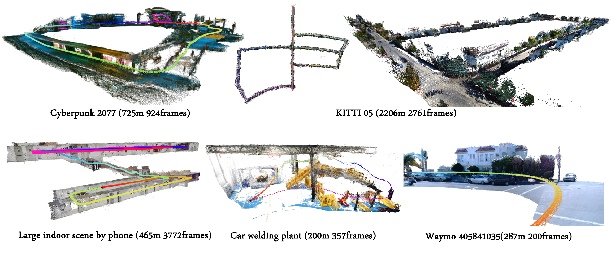

<p align="center">
  
</p>

# HorizonStream: Long-Horizon Attention for Streaming 3D Reconstruction

<p align="center">
  <a href="https://arxiv.org/abs/2605.23889"></a>
  &nbsp;
  <a href="https://3dagentworld.github.io/horizonstream/"></a>
  &nbsp;
  <a href="https://huggingface.co/NicolasCC/HorizonStream"></a>
  &nbsp;
  <a href="https://huggingface.co/spaces/NicolasCC/HorizonStream_Demo"></a>
</p>

<video src="https://github.com/user-attachments/assets/5d24ec97-25f3-4ee5-99ad-8d755915b906" poster="https://raw.githubusercontent.com/3DAgentWorld/HorizonStream/main/assets/teaser_v7.png" controls width="960"></video>

## Summary

**HorizonStream** performs stable online 3D reconstruction from streaming RGB video over 10,000+ frames with constant memory and linear time.

### Highlights
- **Constant memory, linear time**: Peak GPU memory stays flat  (~8.5 GB, Sli1) from 200 to 10,000+ frames.
- **48-frame training → 10K+ generalization**: The geometric inductive bias of the evidence influence kernel enables length generalization far beyond the training horizon.
- **Stable across diverse scenes**: Urban driving, large-scale outdoor, indoor, game, and industrial videos.
- **Optional loop closure**: An optional lightweight loop-closure module further improves global trajectory consistency.

## ToDoList

- [x] Weights release
- [x] Optional loop closure
- [x] Image-sequence inference
- [x] Video inference
- [x] Evaluation
- [x] Interactive Viser demo
- [x] Gradio demo
- [x] Depth-fusion post-processing utility
- [ ] Data processing scripts
- [ ] Render script
- [ ] Training code release

## Installation

Quick install:

```bash
conda create -n horizonstream python=3.11 -y
conda activate horizonstream
pip install torch==2.8.0 torchvision==0.23.0 torchaudio==2.8.0 --index-url https://download.pytorch.org/whl/cu128
pip install -r requirements.txt
```

Download release weights:

```bash
python scripts/download_weights.py
```

`requirements.txt` includes the demo dependencies and `faiss-cpu`. If you want CUDA FAISS for loop closure, replace the CPU package with one that matches your environment. For CUDA 12, one option is:

```bash
pip uninstall -y faiss-cpu
pip install faiss-gpu-cu12
```

Notes:
- The default config uses `flash-linear-attention`.
- Loop closure uses `pypose` and FAISS.

## Quick Start

Run on a video with a local checkpoint:

```bash
python infer.py \
  --config configs/horizonstream_infer.yaml \
  --video-path /path/to/input.mp4 \
  --checkpoint checkpoints/HorizonStream.pt \
  --output-root outputs_horizonstream/input_video
```

Run on a prepared `generalizable` meta-root with a local checkpoint:

```bash
python infer.py \
  --config configs/horizonstream_infer.yaml \
  --img-path /path/to/meta_root \
  --checkpoint checkpoints/HorizonStream.pt \
  --output-root outputs_horizonstream/meta_root
```

`infer.py` runs loop closure by default after inference. Add `--no-loop` to disable it. If loop weights are missing and cannot be downloaded, loop closure is skipped and the main inference output is kept.

Add `--fps 10` to sample a target video frame rate. Add `--offload-outputs-to-cpu` for long videos to reduce persistent VRAM use.

Minimal Python inference:

```python
import torch
import yaml

from horizonstream.core.model import HorizonStreamModel
from horizonstream.utils.vendor.dust3r.utils.image import load_images_for_eval

image_names = [
    "path/to/imageA.png",
    "path/to/imageB.png",
    "path/to/imageC.png",
]

device = "cuda" if torch.cuda.is_available() else "cpu"

with open("configs/horizonstream_infer.yaml", "r") as f:
    cfg = yaml.safe_load(f)

model_cfg = cfg["model"]
model_cfg["checkpoint"] = "checkpoints/HorizonStream.pt"
model = HorizonStreamModel(model_cfg).to(device).eval()

views = load_images_for_eval(
    image_names,
    size=cfg["data"].get("size", 518),
    crop=cfg["data"].get("crop", True),
    patch_size=cfg["data"].get("patch_size", 14),
    verbose=False,
)
images = torch.stack([view["img"][0] for view in views], dim=0)[None].to(device)

with torch.no_grad(), torch.cuda.amp.autocast(enabled=device == "cuda", dtype=torch.float16):
    predictions = model.forward_window(images)

# predictions contains camera, depth, and confidence outputs for the window.
print(predictions.keys())
```

## Inputs and Dataset Format

HorizonStream can run directly on a video with `--video-path`, or on image sequences prepared in the `generalizable` layout.

<details>
<summary>Directory layout, dataset sources, and outputs</summary>

```text
<meta_root>/
  data_roots.txt
  <scene_name>/
    images/
      <camera_id>/
        000000.png|jpg
        000001.png|jpg
        ...
    cameras/
      <camera_id>/
        intri.yml
        extri.yml
    depths/                 # optional, only needed for depth/trajectory evaluation
      <camera_id>/
        000000.exr
        000001.exr
        ...
```

Conventions:

- `extri.yml` stores world-to-camera (`w2c`) extrinsics.
- `intri.yml` follows the OpenCV pinhole camera convention.
- Depth maps are metric depths along positive camera `z`.

Dataset sources:
- [KITTI Odometry](https://www.cvlibs.net/datasets/kitti/eval_odometry.php): download the official odometry sequences.
- [Waymo Open Dataset](https://waymo.com/open/download): download the official Waymo data, then export or reorganize it into the layout above.
- [VBR processed](https://huggingface.co/datasets/Junyi42/vbr_processed): download the LoGeR processed VBR release. See the [LoGeR VBR note](https://github.com/Junyi42/LoGeR/blob/main/eval/eval.md#vbr) for its original evaluation setup.

Conversion helpers:

```bash
python scripts/kitti_to_generalizable.py --src /path/to/kitti_odometry_root --out /path/to/meta_root
python scripts/waymo_to_generalizable.py --src /path/to/waymo_meta_root --out /path/to/meta_root
python scripts/vbr_processed_to_generalizable.py --src /path/to/vbr_processed_root --out /path/to/meta_root
```

**Outputs**

For each sequence, HorizonStream writes:

- `poses/abs_pose.txt`: online `w2c` poses.
- `poses/offline_abs_pose.txt`: offline motion-averaged poses, when enabled.
- `poses/loop_abs_pose.txt`: loop-closure poses, when loop closure is run.
- `poses/intri.txt`: intrinsics.
- `depth/dpt/`, `depth/conf/`: predicted depth and confidence.
- `images/rgb/`, `images/rgb.mp4`: RGB exports.
- `points/full.ply`: global point cloud.
- `points/full_lc.ply`: loop-closure global point cloud, when available.
- `points/fused.ply`, `points/fused_lc.ply`: optional depth-fused point clouds from `scripts/post_depthfusion.py`.

</details>

## Checkpoints

Download the released files from the [HorizonStream Hugging Face repo](https://huggingface.co/NicolasCC/HorizonStream/tree/main) and place them under `checkpoints/`:

| File | URL | Use |
| --- | --- | --- |
| `HorizonStream.pt` | [download](https://huggingface.co/NicolasCC/HorizonStream/resolve/main/HorizonStream.pt) | default release checkpoint |

For sky segmentation, download [`skyseg.onnx`](https://huggingface.co/NicolasCC/HorizonStream/resolve/main/skyseg.onnx) and place it under `checkpoints/`.

## Full Pipeline

`run_pipeline.py` wraps inference, optional loop closure, and optional trajectory evaluation.

```bash
python run_pipeline.py \
  --config configs/horizonstream_infer.yaml \
  --img-path /path/to/meta_root \
  --checkpoint checkpoints/HorizonStream.pt \
  --output-root outputs_horizonstream/run
```

The reported paper inference uses `--sliding-size 21`. To reduce GPU memory, use a smaller sliding size. The minimum `--sliding-size 1` runs fully streaming inference and needs about 8.5 GB peak GPU memory. For long sequences, use `--offload-outputs-to-cpu` to prevent accumulated outputs from causing OOM.

For KITTI, disabling camera undistortion is more accurate in our evaluation: --no-camera-preprocess.

For other datasets, keep camera preprocessing enabled unless you have already undistorted and aligned the cameras yourself.

Add `--seq-list <scene_name>` and `--camera <camera_id>` only when selecting a specific scene/camera from multi-scene or multi-camera data.

<details>
<summary>Inference and evaluation parameters</summary>

| Arg | Meaning |
| --- | --- |
| `--fps 10` | sample a target frame rate from video input |
| `--seq-list <scene_name>`, `--camera <camera_id>` | select a specific scene/camera from multi-scene or multi-camera data |
| `--sliding-size 21` | streaming chunk size used for reported paper inference results |
| `--offload-outputs-to-cpu` | offload accumulated outputs to CPU for long sequences to avoid OOM |
| `--camera-preprocess`, `--no-camera-preprocess` | enable or disable camera undistortion/preprocessing |
| `--gt-img-path`, `--gt-seq-list`, `--gt-camera` | use a separate ground-truth meta-root for evaluation |
| `--max-frames` | run a short subset for debugging |

</details>

Point-cloud saving includes depth-range filtering, sky filtering, voxel/random downsampling, and isolated-point filtering. These options are useful for cleaner outdoor point clouds.

<details>
<summary>Point-cloud filtering parameters</summary>

| Arg | Meaning |
| --- | --- |
| `--point-mask-sky`, `--no-point-mask-sky` | enable or disable sky-mask filtering for point clouds |
| `--point-depth-min`, `--point-depth-max` | keep points within a metric depth range |
| `--point-voxel-size` | voxel-downsample global point clouds |
| `--point-random-sample-ratio` | randomly keep a fraction of points |
| `--max-full-pointcloud-points` | cap each saved global point cloud |
| `--point-outlier-filter`, `--no-point-outlier-filter` | enable or disable isolated-point filtering |

</details>

### Loop Closure

`infer.py` runs loop closure by default. Use `--no-loop` to disable it.

The default parameters work well for most scenes. Some scenes may need parameter adjustment:

- If no loop is detected, lower `--salad-score-thresh`.
- If false or redundant loops are detected, raise `--salad-score-thresh`.
- If loops are detected but the trajectory does not close enough, increase `--pose-graph-loop-weight`.
- Use `--temporal-exclusion` and `--min-frame-separation` to suppress nearby frames as loop candidates.
- Use `--loop-edge-score-threshold` to filter weak accepted loop edges when needed.

If loop assets are unavailable, loop closure is skipped instead of failing inference.

### Evaluation

Evaluate an existing output root against ground-truth poses in a `generalizable` meta-root:

```bash
python scripts/evaluate_trajectory.py \
  --config configs/horizonstream_infer.yaml \
  --output-root outputs_horizonstream/run \
  --img-path /path/to/meta_root
```

Add `--seq-list` and `--camera` only when your meta-root contains multiple scenes or cameras and you want a specific subset. This writes `eval_summary.json` and per-sequence `eval/trajectory_metrics.json` files.

### Depth Fusion

Depth fusion can further improve point-cloud consistency in some scenes, reducing floating points and ghosting artifacts. The paper-reported results do not include this post-processing step.

Fuse the saved depth maps from a completed sequence:

```bash
python scripts/post_depthfusion.py \
  --sequence-dir outputs_horizonstream/run/your_sequence_name
```

Or process all sequence outputs under one root:

```bash
python scripts/post_depthfusion.py \
  --output-root outputs_horizonstream/run
```

By default, depth fusion uses loop-closure poses when available and online poses otherwise.

## Demo

### Gradio App

```bash
python demo_gradio_viser.py
```

The Gradio app is the end-to-end demo for uploaded videos or image sequences. Disable `Run Loop Closure` in the UI to run inference only.

### 3D Interactive Viewer

Open an existing HorizonStream output directory in the interactive Viser viewer:

```bash
python demo_viser_only.py \
  --sequence_dir /path/to/outputs_horizonstream/sequence \
  --port 8080
```

Or inspect a prepared `generalizable` scene directly:

```bash
python demo_viser_only.py \
  --sequence_dir /path/to/meta_root/scene_name \
  --camera_id camera_id \
  --port 8080
```

## Citation

If you find this release useful, please cite HorizonStream. Our related work LongStream is also relevant for long-sequence streaming visual geometry and can be cited together when appropriate.

```bibtex
@article{cheng2026horizonstream,
  title={HorizonStream: Long-Horizon Attention for Streaming 3D Reconstruction},
  author={Chong Cheng and Peilin Tao and Nanjie Yao and Guanzhi Ding and Xianda Chen and Yuansen Du and Xiaoyang Guo and Wei Yin and Weiqiang Ren and Qian Zhang and Zhengqing Chen and Hao Wang},
  journal={arXiv preprint arXiv:2605.23889},
  year={2026}
}

@article{cheng2026longstream,
  title={LongStream: Long-Sequence Streaming Autoregressive Visual Geometry},
  author={Chong Cheng and Xianda Chen and Tao Xie and Wei Yin and Weiqiang Ren and Qian Zhang and Xiaoyuang Guo and Hao Wang},
  journal={arXiv preprint arXiv:2602.13172},
  year={2026}
}
```

## Acknowledgements

We thank the authors and open-source projects of VGGT, Stream3R, StreamVGGT, DUSt3R, VGGT-Long and related streaming 3D reconstruction work for releasing code and ideas that informed this inference package.
